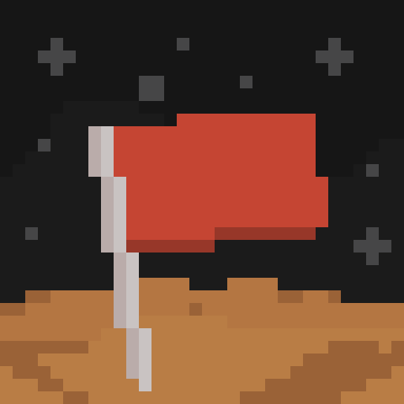
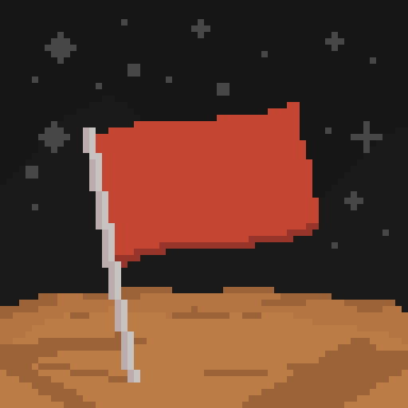
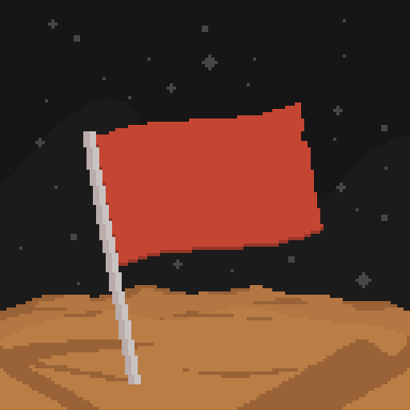
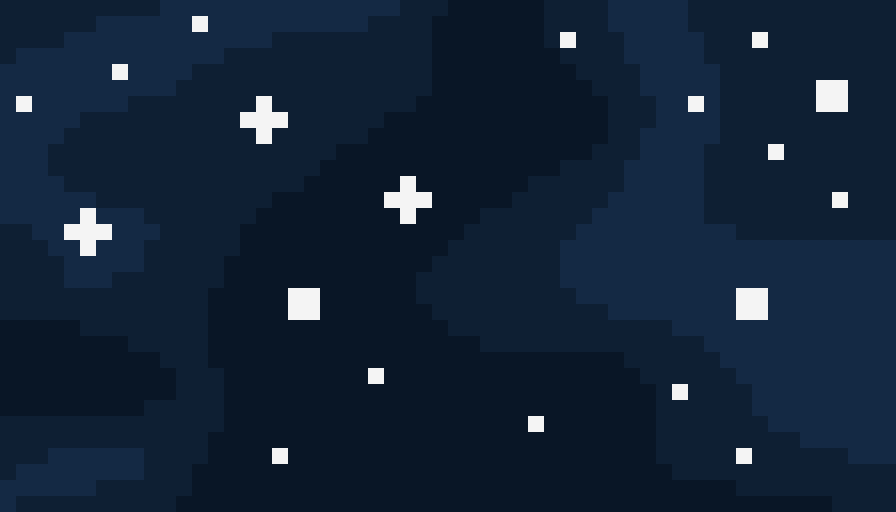
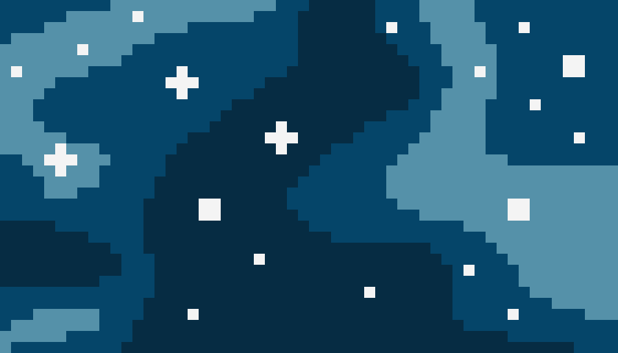
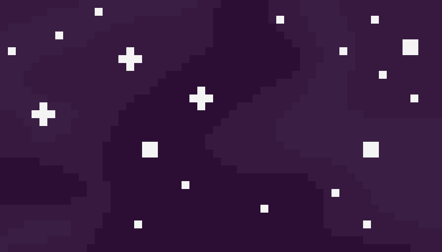

<!-- markdownlint-disable MD033 -->
<!-- markdownlint-disable MD009 -->

# Mission to Mars Assets

> **NOTE:**  
> Assets/licenses are subject to change.

Assets for the modpack [Mission to Mars](http://modrinth.com/modpack/mission-to-mars),
created by the wonderful [Addict on Fiverr](https://www.fiverr.com/yahya_km)!

Mission to Mars' assets are licensed under the [MIT License](/LICENSE).

## Overview

Assets made using [Aseprite](https://www.aseprite.org/).  
Assets upscaled using Lospec's [Pixel Art Scaler](https://lospec.com/pixel-art-scaler/).

### Icons

### Banners

  
  

