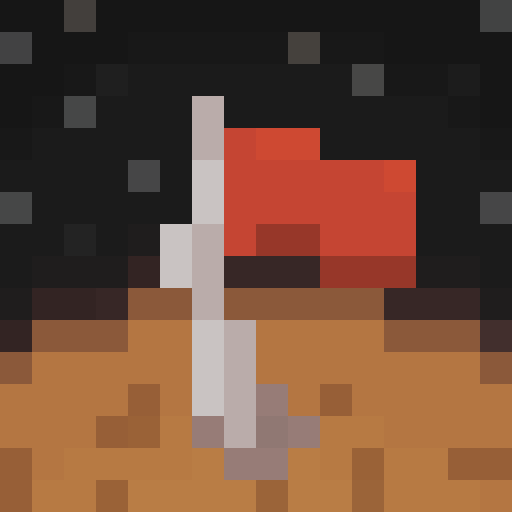
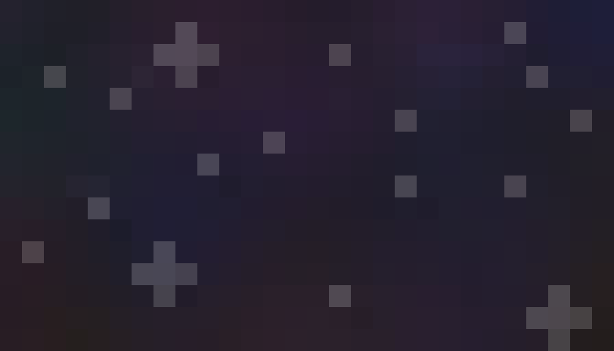

# Mission to Mars Assets

> **NOTE:**  
> Assets/licenses are subject to change.

Assets for the modpack [Mission to Mars](http://modrinth.com/modpack/mission-to-mars).

Mission to Mars' assets are licensed under the [MIT License](/LICENSE).

## Overview

Assets made using [Aseprite](https://www.aseprite.org/).  
Assets upscaled using Lospec's [Pixel Art Scaler](https://lospec.com/pixel-art-scaler/).

